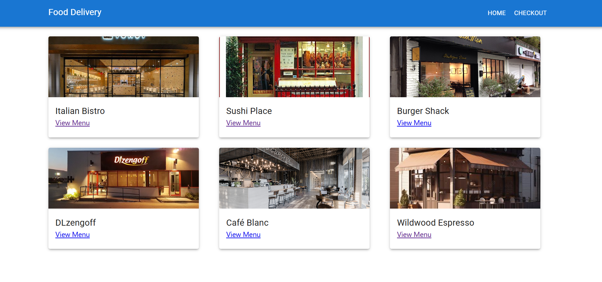

# 🍔 FoodDelivery

FoodDelivery is a modern, responsive web application built using **React** and **Tailwind CSS**. It allows users to browse food items, view product details, and add new products dynamically. This project showcases a basic product catalog system for a food delivery platform.

---

## 📸 Screenshots

  
*Add more screenshots if available*

---

## 🚀 Features

- 🖼️ Browse food items with images and descriptions  
- ➕ Add new products to the catalog  
- ⚡ Clean and responsive UI using Tailwind CSS  
- ⚛️ Built entirely with React components  
- 🎯 Simple state management using React hooks  

---

## 🛠️ Tech Stack

- **Frontend**: React, Tailwind CSS  
- **Language**: JavaScript (ES6)  
- **Tooling**: Vite or Create React App (depending on your setup)

---

## 📦 Installation

Follow these steps to run the project locally:

```bash
# Clone the repository
git clone https://github.com/suvetharani/FoodDelivery.git

# Navigate into the project folder
cd FoodDelivery

# Install dependencies
npm install

# Start the development server
npm start
```

🙋‍♀️ Author
Made with ❤️ by Suvetharani

